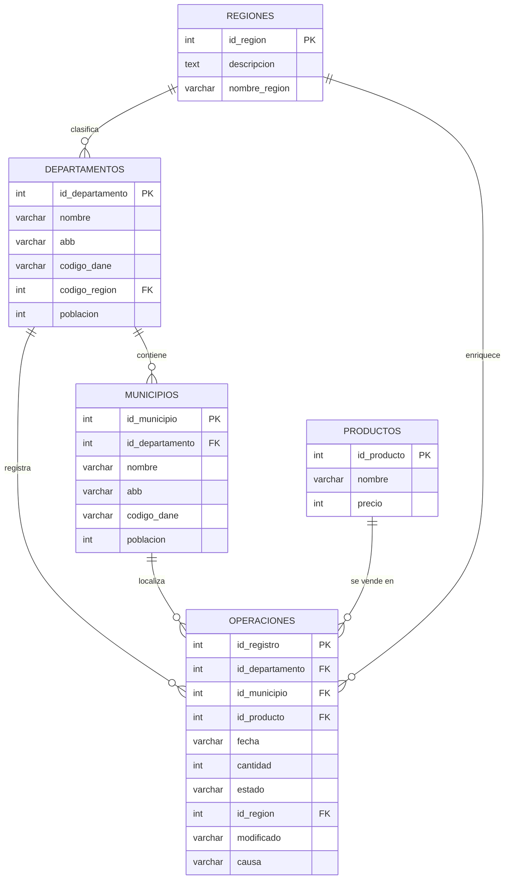
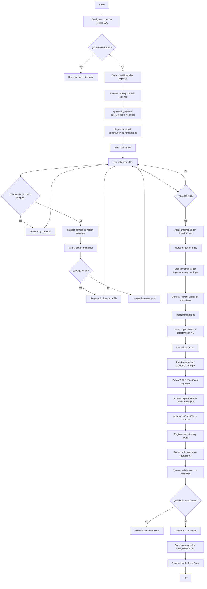

# INFORME: Evaluación práctica de la Unidad 1 - Caso "Gaseosas Poderosas"

**Institución:** IU Pascual Bravo  
**Asignatura:** ET0155 - Fundamentos de Big Data  
**Periodo:** 2024-2  
**Grupo:** N  
**Caso de estudio:** Empresa Gaseosas Poderosas  
**Fecha del informe:** 2026-09-26  

## Miembros del equipo

| No. | Nombre |
|---:|---|
| 1 | Emmanuel Berrio Jimenez |
| 2 | Juan Esteban Correa |

> **Nota de evidencia.** Los resultados numéricos de procesamiento y los ejemplos de registros se consolidan a partir del informe Word y los videos entregados en el workspace. Los marcadores de capturas deben reemplazarse por las imágenes definitivas tomadas en pgAdmin y Excel.

## 1. Descripción de la Tarea

La empresa **Gaseosas Poderosas** necesita convertir datos operativos de ventas en información confiable para la toma de decisiones comerciales. El trabajo integra modelado relacional, un proceso ETL desarrollado en Python, limpieza de datos, enriquecimiento geográfico y construcción de un pipeline analítico sobre PostgreSQL y Excel.

El flujo implementado parte de archivos de referencia del DANE y registros de operaciones de venta. Python extrae los datos, valida su estructura, normaliza códigos y nombres, clasifica los departamentos por región y carga las entidades geográficas en PostgreSQL. La base de datos conserva las operaciones transaccionales y expone la vista `vista_operaciones`, que concentra los nombres descriptivos y calcula el monto de venta como:

```text
total_venta = cantidad * precio
```

El proceso de limpieza identifica fechas con formato irregular, cantidades en cero o negativas, códigos de departamento faltantes y productos faltantes en un municipio específico. Cada corrección se registra en los campos auditables `modificado` y `causa`, permitiendo distinguir los datos originales de los valores transformados.

Finalmente, las consultas SQL se ejecutan exclusivamente sobre `vista_operaciones`. Sus resultados se exportan a Excel para construir diagramas de Pareto y gráficos de torta, con el objetivo de visualizar concentración de ventas, comportamiento regional y participación por producto.

### Alcance técnico

- Motor de base de datos: PostgreSQL.
- Lenguaje de integración y carga: Python.
- Fuentes geográficas: CSV de departamentos y municipios del DANE.
- Fuente de operaciones: registros de ventas cargados en la base de datos.
- Capa analítica: vista consolidada `vista_operaciones`.
- Visualización: Excel.
- Tablas de apoyo: `temporal` y `tamanio`.

## 2. Diagrama de Entidad - Relación (Diagrama de Chen)

El siguiente modelo representa las cinco entidades principales solicitadas. La tabla `tamanio` se excluye del modelo porque se utiliza únicamente para el benchmark de almacenamiento y procesamiento.



### Cardinalidades

| Relación | Cardinalidad | Interpretación |
|---|---:|---|
| `regiones` - `departamentos` | 1:M | Una región agrupa varios departamentos; cada departamento pertenece a una región. |
| `departamentos` - `municipios` | 1:M | Un departamento contiene varios municipios; cada municipio pertenece a un departamento. |
| `departamentos` - `operaciones` | 1:M | Un departamento puede aparecer en muchas operaciones. |
| `municipios` - `operaciones` | 1:M | Un municipio puede tener muchas operaciones. |
| `productos` - `operaciones` | 1:M | Un producto puede estar presente en muchas operaciones. |
| `regiones` - `operaciones` | 1:M | Una región puede concentrar muchas operaciones mediante `id_region`. |

## 3. Diccionario de Datos

> `NOT NULL` se documenta según el modelo lógico y las reglas de integridad esperadas. La nulabilidad efectiva debe confirmarse con `information_schema.columns` en la instancia PostgreSQL utilizada para la entrega.

### 3.1 Tabla `departamentos`

| Nombre de campo | Tipo de dato | Longitud/Tamaño | PK | FK | Nulabilidad | Descripción |
|---|---|---:|:---:|:---:|:---:|---|
| `id_departamento` | INTEGER | 4 bytes | Sí | No | NOT NULL | Identificador interno único del departamento. |
| `nombre` | VARCHAR | 70 | No | No | NOT NULL | Nombre completo del departamento. |
| `abb` | VARCHAR | 3 | No | No | NULL | Abreviatura del departamento. |
| `codigo_dane` | VARCHAR | 10 | No | No | NULL | Código oficial DANE del departamento. |
| `codigo_region` | INTEGER | 4 bytes | No | Sí, `regiones.id_region` | NULL | Región geográfica asignada. |
| `poblacion` | INTEGER | 4 bytes | No | No | NULL | Población de referencia del departamento. |

### 3.2 Tabla `municipios`

| Nombre de campo | Tipo de dato | Longitud/Tamaño | PK | FK | Nulabilidad | Descripción |
|---|---|---:|:---:|:---:|:---:|---|
| `id_departamento` | INTEGER | 4 bytes | No | Sí, `departamentos.id_departamento` | NOT NULL | Departamento al que pertenece el municipio. |
| `id_municipio` | INTEGER | 4 bytes | Sí | No | NOT NULL | Identificador interno único del municipio. |
| `nombre` | VARCHAR | 70 | No | No | NOT NULL | Nombre del municipio. |
| `abb` | VARCHAR | 5 | No | No | NULL | Abreviatura del municipio. |
| `codigo_dane` | VARCHAR | 10 | No | No | NULL | Código oficial DANE del municipio. |
| `poblacion` | INTEGER | 4 bytes | No | No | NULL | Población de referencia del municipio. |

### 3.3 Tabla `productos`

| Nombre de campo | Tipo de dato | Longitud/Tamaño | PK | FK | Nulabilidad | Descripción |
|---|---|---:|:---:|:---:|:---:|---|
| `id_producto` | INTEGER | 4 bytes | Sí | No | NOT NULL | Identificador único del producto. |
| `nombre` | VARCHAR | 20 | No | No | NOT NULL | Nombre comercial de la gaseosa. |
| `precio` | INTEGER | 4 bytes | No | No | NULL | Precio unitario utilizado para calcular el monto de venta. |

### 3.4 Tabla `regiones`

| Nombre de campo | Tipo de dato | Longitud/Tamaño | PK | FK | Nulabilidad | Descripción |
|---|---|---:|:---:|:---:|:---:|---|
| `id_region` | INTEGER | 4 bytes | Sí | No | NOT NULL | Identificador único de la región geográfica. |
| `descripcion` | TEXT | Variable | No | No | NULL | Descripción ampliada de la región. |
| `nombre_region` | VARCHAR | 100 | No | No | NOT NULL | Nombre de la región. |

### 3.5 Tabla `operaciones`

| Nombre de campo | Tipo de dato | Longitud/Tamaño | PK | FK | Nulabilidad | Descripción |
|---|---|---:|:---:|:---:|:---:|---|
| `id_registro` | INTEGER | 4 bytes | Sí | No | NOT NULL | Identificador único de la operación. |
| `id_departamento` | INTEGER | 4 bytes | No | Sí, `departamentos.id_departamento` | NOT NULL | Departamento donde se registra la venta. |
| `id_municipio` | INTEGER | 4 bytes | No | Sí, `municipios.id_municipio` | NOT NULL | Municipio donde se registra la venta. |
| `id_producto` | INTEGER | 4 bytes | No | Sí, `productos.id_producto` | NOT NULL | Producto vendido. |
| `fecha` | VARCHAR | 10 | No | No | NULL | Fecha de la operación. El formato objetivo es `AAAA-MM-DD`. |
| `cantidad` | INTEGER | 4 bytes | No | No | NULL | Unidades vendidas en la operación. |
| `estado` | VARCHAR | 1 | No | No | NULL | Estado de la operación: `V` válida o `I` inválida. |
| `id_region` | INTEGER | 4 bytes | No | Sí, `regiones.id_region` | NULL | Región derivada del departamento. |
| `modificado` | VARCHAR | 2 | No | No | NULL | Indicador de corrección: `SI` o `NO`. |
| `causa` | VARCHAR | 255 | No | No | NULL | Motivo y tratamiento aplicado a la corrección. |

### 3.6 Vista `vista_operaciones`

La vista presenta una proyección analítica de las operaciones, reemplazando códigos por nombres y exponiendo el cálculo `total_venta`. Los nombres de columnas se documentan según la consulta y el informe entregados.

| Nombre de campo | Tipo de dato lógico | Longitud/Tamaño | PK | FK | Nulabilidad | Descripción |
|---|---|---:|:---:|:---:|:---:|---|
| `id_registro` | INTEGER | 4 bytes | No | No | NOT NULL | Identificador de la operación de origen. |
| `id_departamento` | INTEGER | 4 bytes | No | No | NULL | Código interno del departamento. |
| `departamento` | VARCHAR | 70 | No | No | NULL | Nombre del departamento. |
| `id_municipio` | INTEGER | 4 bytes | No | No | NULL | Código interno del municipio. |
| `municipio` | VARCHAR | 70 | No | No | NULL | Nombre del municipio. |
| `id_producto` | INTEGER | 4 bytes | No | No | NULL | Código interno del producto. |
| `producto` | VARCHAR | 20 | No | No | NULL | Nombre comercial del producto. |
| `precio` | INTEGER | 4 bytes | No | No | NULL | Precio unitario. |
| `fecha` | VARCHAR | 10 | No | No | NULL | Fecha de la operación. |
| `cantidad` | INTEGER | 4 bytes | No | No | NULL | Unidades vendidas. |
| `estado` | VARCHAR | 1 | No | No | NULL | Estado de la operación. |
| `id_region` | INTEGER | 4 bytes | No | No | NULL | Identificador de la región. |
| `region` | VARCHAR | 100 | No | No | NULL | Nombre de la región. |
| `total_venta` | NUMERIC/INTEGER | Según expresión | No | No | NULL | Resultado de `cantidad * precio`. |
| `modificado` | VARCHAR | 2 | No | No | NULL | Indicador de si la operación fue corregida. |
| `causa` | VARCHAR | 255 | No | No | NULL | Causa de la transformación aplicada. |

## 4. Corrida del Algoritmo ETL

### 4.1 Extract: extracción

La fase Extract obtiene información de dos fuentes principales:

1. `colombia-dane-departamentos.csv`, con región, código DANE del departamento, nombre del departamento, código DANE del municipio y nombre del municipio.
2. Los registros de operaciones almacenados en PostgreSQL, utilizados para poblar la tabla analítica y para aplicar las reglas de calidad.

El algoritmo abre el CSV con codificación UTF-8, omite la cabecera y valida que cada fila tenga al menos cinco campos antes de enviarla a la tabla temporal.

```python
with open(archivo_fisico, encoding="utf-8") as archivo:
    hoja_calculo = csv.reader(
        archivo,
        delimiter=",",
        quotechar='"',
        quoting=csv.QUOTE_MINIMAL,
    )

    for fila in hoja_calculo:
        if contador_registros > 0 and len(fila) >= 5:
            nombre_region = fila[0]
            codigo_region = getCodigoRegion(nombre_region)
            cargarTablaTemporal(
                connection,
                cursor,
                contador_registros,
                nombre_region,
                codigo_region,
                fila[1],
                fila[2],
                fila[3],
                fila[4],
            )
        contador_registros += 1
```

### 4.2 Transform: transformación

La transformación aplica las siguientes reglas:

- Convierte el código de departamento en un identificador interno compuesto por el código del país `57` y el código DANE de dos dígitos.
- Genera identificadores de municipio combinando el identificador del departamento con un consecutivo dentro del departamento.
- Limita nombres a las longitudes establecidas por el modelo.
- Convierte cada nombre de región en un código entero de 1 a 6.
- Valida códigos municipales anómalos antes de insertar.
- Determina la región de cada operación a partir del departamento relacionado.
- Marca y corrige registros con problemas mediante `modificado` y `causa`.

### 4.3 Load: carga

La carga se realiza en PostgreSQL mediante `psycopg2` y sentencias parametrizadas. Primero se actualiza el esquema, luego se limpian las tablas de apoyo y finalmente se insertan los registros en `temporal`, `departamentos`, `municipios`, `regiones` y `operaciones`.

```python
cursor.execute(comando_sql, valores)
connection.commit()
```

Cuando una operación de inserción falla, el algoritmo ejecuta `rollback()` para impedir que la transacción quede abortada y poder registrar el error de forma controlada. El resultado final alimenta `vista_operaciones`, que es la única superficie usada para las consultas de negocio.


## 5. Modificación del Algoritmo ETL (Inclusión de Región)

La modificación incorpora una dimensión geográfica explícita. La tabla `regiones` permite centralizar el catálogo de regiones, mientras que `departamentos.codigo_region` y `operaciones.id_region` permiten navegar desde una venta hasta su agrupación territorial.

### 5.1 Creación del catálogo de regiones

```python
cursor.execute("""
    CREATE TABLE IF NOT EXISTS regiones (
        id_region INT PRIMARY KEY,
        nombre_region VARCHAR(100),
        descripcion VARCHAR(255)
    );
""")

regiones_data = [
    (1, "Region Eje Cafetero - Antioquia", "Region Eje Cafetero - Antioquia"),
    (2, "Region Centro Oriente", "Region Centro Oriente"),
    (3, "Region Centro Sur", "Region Centro Sur"),
    (4, "Region Caribe", "Region Caribe"),
    (5, "Region Llano", "Region Llano"),
    (6, "Region Pacifico", "Region Pacifico"),
]

for region_id, nombre, descripcion in regiones_data:
    cursor.execute("""
        INSERT INTO regiones (id_region, nombre_region, descripcion)
        VALUES (%s, %s, %s)
        ON CONFLICT (id_region) DO UPDATE
        SET nombre_region = EXCLUDED.nombre_region,
            descripcion = EXCLUDED.descripcion;
    """, (region_id, nombre, descripcion))
```

### 5.2 Mapeo de regiones

```python
def getCodigoRegion(region):
    mapa_regiones = {
        "Region Eje Cafetero - Antioquia": 1,
        "Region Centro Oriente": 2,
        "Region Centro Sur": 3,
        "Region Caribe": 4,
        "Region Llano": 5,
        "Region Pacifico": 6,
    }
    return mapa_regiones.get(region, 0)
```

### 5.3 Alteración y valorización de `operaciones`

```sql
DO $$
BEGIN
    IF NOT EXISTS (
        SELECT 1
        FROM information_schema.columns
        WHERE table_name = 'operaciones'
          AND column_name = 'id_region'
    ) THEN
        ALTER TABLE operaciones ADD COLUMN id_region INT;
    END IF;
END $$;

UPDATE operaciones AS op
SET id_region = d.codigo_region
FROM municipios AS m
JOIN departamentos AS d
  ON m.id_departamento = d.id_departamento
WHERE op.id_municipio = m.id_municipio;
```

La verificación debe comprobar que no queden operaciones con región nula cuando el departamento y el municipio sean válidos:

```sql
SELECT COUNT(*) AS operaciones_sin_region
FROM operaciones
WHERE id_region IS NULL;
```

## 6. Detectar Registros con Problemas y Transformación de Datos

La calidad de datos se controló con análisis exploratorio, reglas de validación y campos de auditoría. `modificado` registra `SI` cuando la fila fue transformada y `NO` cuando conserva sus valores originales. `causa` documenta la regla aplicada y permite explicar cada cambio durante una auditoría.

### 6.1 Tipos de incidencias y tratamiento

| Tipo | Campo afectado | Incidencia | Regla de transformación | Evidencia o causa registrada |
|---|---|---|---|---|
| A | `fecha` | Fecha fuera del formato `AAAA-MM-DD`. Ejemplo: `024-07-17`. | Convertir la cadena al formato ISO mediante lógica `CASE` y conversión de fecha. | `Formato Fecha Corregido` |
| B | `cantidad` | Cantidad igual a cero. | Imputar el promedio de ventas del municipio correspondiente, excluyendo ceros cuando sea necesario. | `Imputación Promedio Municipio` |
| C | `cantidad` | Cantidad negativa. | Convertir a positivo mediante `ABS(cantidad)`. | `Signo Negativo Corregido` |
| D | `id_departamento` | Código igual a cero o nulo. | Recuperar el departamento asociado al municipio conocido en otras operaciones. | `Departamento Imputado` |
| E | `id_producto` | Producto faltante en Támesis, Antioquia. | Asignar directamente el código del producto `NARANJITA`. | `Producto Imputado (Naranjita)` |

### 6.2 Registros de ejemplo

| Tipo | `id_registro` | Campo | Valor observado | Tratamiento |
|---|---:|---|---|---|
| A | 12110 | `fecha` | Formato diferente de `AAAA-MM-DD`. | Normalización de la fecha. |
| B | 10225 | `cantidad` | `0`. | Promedio del municipio. |
| C | 11907 | `cantidad` | `-144`. | `ABS(cantidad)`. |
| D | 10326 | `id_departamento` | `0` o nulo. | Cruce con el municipio. |
| E | 10014 | `id_producto` | `0` o nulo en Támesis. | Código de `NARANJITA`. |

### 6.3 Código SQL representativo de la limpieza

```sql
-- Tipo A: normalización de fecha
UPDATE operaciones
SET fecha = CASE
                WHEN fecha ~ '^\\d{3}-\\d{2}-\\d{2}$'
                    THEN '2' || fecha
                WHEN fecha ~ '^\\d{2}-\\d{2}-\\d{4}$'
                    THEN SUBSTRING(fecha FROM 7 FOR 4) || '-'
                         || SUBSTRING(fecha FROM 4 FOR 2) || '-'
                         || SUBSTRING(fecha FROM 1 FOR 2)
                ELSE fecha
            END,
    modificado = 'SI',
    causa = 'Formato Fecha Corregido'
WHERE id_registro = 12110;

-- Tipo B: imputación del promedio del municipio
UPDATE operaciones AS op
SET cantidad = promedio.promedio_cantidad,
    modificado = 'SI',
    causa = 'Imputación Promedio Municipio'
FROM (
    SELECT id_municipio,
           ROUND(AVG(cantidad))::INTEGER AS promedio_cantidad
    FROM operaciones
    WHERE cantidad > 0
    GROUP BY id_municipio
) AS promedio
WHERE op.id_municipio = promedio.id_municipio
  AND op.id_registro = 10225
  AND op.cantidad = 0;

-- Tipo C: corrección de signo
UPDATE operaciones
SET cantidad = ABS(cantidad),
    modificado = 'SI',
    causa = 'Signo Negativo Corregido'
WHERE id_registro = 11907
  AND cantidad < 0;

-- Tipo D: imputación del departamento desde el municipio
UPDATE operaciones AS op
SET id_departamento = municipio.id_departamento,
    modificado = 'SI',
    causa = 'Departamento Imputado'
FROM municipios AS municipio
WHERE op.id_municipio = municipio.id_municipio
  AND op.id_registro = 10326
  AND (op.id_departamento = 0 OR op.id_departamento IS NULL);

-- Tipo E: producto faltante en Támesis
UPDATE operaciones AS op
SET id_producto = producto.id_producto,
    modificado = 'SI',
    causa = 'Producto Imputado (Naranjita)'
FROM productos AS producto
JOIN municipios AS municipio
  ON municipio.id_municipio = op.id_municipio
JOIN departamentos AS departamento
  ON departamento.id_departamento = municipio.id_departamento
WHERE op.id_registro = 10014
  AND municipio.nombre = 'Tamesis'
  AND departamento.nombre = 'Antioquia'
  AND producto.nombre = 'NARANJITA';
```

> En una ejecución productiva, las reglas deben generalizarse a conjuntos de registros y aplicarse dentro de una transacción controlada, conservando una copia de los valores originales o una bitácora de cambios.

## 7. Tabla de Consultas SQL

**Todas las consultas de esta sección usan exclusivamente la vista `vista_operaciones`.** No se consultan directamente las tablas base. Esto reduce la duplicación de lógica, centraliza los `JOIN` y garantiza que los indicadores usen nombres y cálculos consistentes.

### 7.1 Top 8 departamentos por monto total de ventas

```sql
SELECT departamento,
       SUM(total_venta) AS monto_total
FROM vista_operaciones
GROUP BY departamento
ORDER BY monto_total DESC
LIMIT 8;
```

### 7.2 Top 15 municipios por cantidad vendida en Antioquia

```sql
SELECT municipio,
       SUM(cantidad) AS cantidad_total
FROM vista_operaciones
WHERE UPPER(departamento) = 'ANTIOQUIA'
GROUP BY municipio
ORDER BY cantidad_total DESC
LIMIT 15;
```

### 7.3 Top 5 departamentos por cantidad vendida de MANZALOCA

```sql
SELECT departamento,
       SUM(cantidad) AS cantidad_total
FROM vista_operaciones
WHERE UPPER(producto) LIKE '%MANZALOCA%'
GROUP BY departamento
ORDER BY cantidad_total DESC
LIMIT 5;
```

### 7.4 Top 5 municipios con menor monto total de ventas

```sql
SELECT departamento,
       municipio,
       SUM(total_venta) AS monto_total
FROM vista_operaciones
GROUP BY departamento, municipio
ORDER BY monto_total ASC
LIMIT 5;
```

### 7.5 Cantidad vendida de cada producto por región

```sql
SELECT id_region,
       region,
       producto,
       SUM(cantidad) AS cantidad_total
FROM vista_operaciones
GROUP BY id_region, region, producto
ORDER BY cantidad_total DESC;
```

### 7.6 Monto total de cada producto en Antioquia

```sql
SELECT producto,
       SUM(total_venta) AS monto_total
FROM vista_operaciones
WHERE UPPER(departamento) = 'ANTIOQUIA'
GROUP BY producto
ORDER BY monto_total DESC;
```

## 8. Gráficos (Visualización y Análisis)

Los resultados de cada consulta se copian desde pgAdmin a Excel. Para los gráficos de Pareto se ordenan los valores de mayor a menor y se agrega una columna de porcentaje acumulado. Para los gráficos de torta se calcula la participación porcentual de cada categoría sobre el total.

### 8.1 Pareto: departamentos con mayor monto de ventas

#### 8.1.1 Query Editor en pgAdmin

1. Abrir Query Tool en pgAdmin.
2. Ejecutar la consulta 7.1.
3. Confirmar las columnas `departamento` y `monto_total`.
4. Exportar el resultado como CSV o copiarlo al portapapeles.


#### 8.1.2 Gráfico en Excel

1. Pegar `departamento` en la columna A y `monto_total` en la columna B.
2. Ordenar `monto_total` de mayor a menor.
3. Crear en C una columna `porcentaje` con `=B2/SUMA($B$2:$B$9)`.
4. Crear en D `porcentaje_acumulado`; la primera fila usa `=C2` y las siguientes `=D2+C3`.
5. Seleccionar A, B y D.
6. Insertar un gráfico combinado: columnas para monto y línea para porcentaje acumulado en eje secundario.
7. Nombrar ejes: X `Departamento`; Y izquierdo `Monto total`; Y derecho `Porcentaje acumulado`.


### 8.2 Pareto: municipios con mayor cantidad vendida en Antioquia

#### 8.2.1 Query Editor en pgAdmin

Ejecutar la consulta 7.2 y verificar que el filtro corresponda exclusivamente a `ANTIOQUIA`.


#### 8.2.2 Gráfico en Excel

1. Copiar `municipio` y `cantidad_total`.
2. Ordenar de mayor a menor por cantidad.
3. Calcular el porcentaje individual y el acumulado con las mismas fórmulas del apartado 8.1.
4. Insertar columnas para cantidad y una línea para el acumulado.
5. Usar eje X `Municipio`, eje Y izquierdo `Cantidad total` y eje Y derecho `Porcentaje acumulado`.


### 8.3 Pareto: departamentos con mayor cantidad de MANZALOCA

#### 8.3.1 Query Editor en pgAdmin

Ejecutar la consulta 7.3 y comprobar que el producto filtrado sea `MANZALOCA`.


#### 8.3.2 Gráfico en Excel

1. Pegar departamento y cantidad total.
2. Ordenar de mayor a menor.
3. Calcular porcentaje individual y porcentaje acumulado.
4. Construir el gráfico combinado de barras y línea.
5. Usar eje X `Departamento`, eje Y izquierdo `Cantidad de MANZALOCA` y eje Y derecho `Porcentaje acumulado`.


### 8.4 Pareto: municipios con menor monto de ventas

#### 8.4.1 Query Editor en pgAdmin

Ejecutar la consulta 7.4 y conservar simultáneamente las columnas `departamento`, `municipio` y `monto_total`, ya que el nombre municipal puede repetirse en departamentos diferentes.


#### 8.4.2 Gráfico en Excel

1. Crear una etiqueta compuesta `departamento - municipio`.
2. Mantener el orden ascendente entregado por la consulta.
3. Para un Pareto de concentración, ordenar la selección de mayor a menor antes de calcular el acumulado; para evidenciar los municipios críticos, conservar además una tabla auxiliar ascendente.
4. Calcular porcentaje y acumulado.
5. Insertar columnas para monto y línea para porcentaje acumulado.
6. Usar eje X `Departamento - Municipio` y eje Y `Monto total`.


### 8.5 Gráfico de torta: productos por región

#### 8.5.1 Query Editor en pgAdmin

Ejecutar la consulta 7.5. Para graficar una región específica, filtrar en Excel por `region`; para una vista global, resumir por producto.


#### 8.5.2 Gráfico en Excel

1. Crear una tabla dinámica con `region` como filtro, `producto` como filas y `cantidad_total` como valores.
2. Calcular participación con `=cantidad_producto/SUMA(cantidades_de_la_region)`.
3. Seleccionar producto y cantidad.
4. Insertar gráfico circular o de anillo.
5. Activar etiquetas con nombre y porcentaje.
6. Titular el gráfico con la región analizada y el período de datos.


### 8.6 Gráfico de torta: productos en Antioquia

#### 8.6.1 Query Editor en pgAdmin

Ejecutar la consulta 7.6 y confirmar que el indicador utilizado sea `monto_total`, no `cantidad_total`.


#### 8.6.2 Gráfico en Excel

1. Pegar `producto` y `monto_total`.
2. Calcular `participacion = monto_producto / SUMA(montos)`.
3. Insertar un gráfico de torta.
4. Mostrar nombre del producto, valor monetario y porcentaje.
5. Verificar que la suma de participaciones sea 100%.


## 9. Evidencias de Ejecución y Reproducibilidad

El workspace contiene evidencia audiovisual de la ejecución del ETL y de las corridas del benchmark:

| Evidencia | Archivo |
|---|---|
| Ejecución del algoritmo ETL | `evidencia_algoritmo_etl.mp4` |
| Corrida de 10.000 registros | `Prueba_10mil_registros.mp4` |
| Corrida de 100.000 registros | `Prueba_100mil_registros.mp4` |
| Corrida de 1.000.000 registros | `Prueba_1millon_registros.mp4` |
| Corrida de 10.000.000 registros | `Prueba_10millones_registros.mp4` |
| Resultados para Pareto de departamentos | `pareto_departamentos.xlsx` |
| Resultados para Pareto de municipios | `pareto_municipios.xlsx` |
| Distribución de productos | `distribucion_productos.xlsx` |

Para reproducir la práctica:

1. Crear o restaurar la base `bigdata` en PostgreSQL.
2. Confirmar la existencia de tablas y vista.
3. Instalar dependencias Python: `psycopg2` y, cuando se use el ETL original completo, `pandas`.
4. Verificar que las credenciales estén externalizadas antes de ejecutar en otro equipo.
5. Ejecutar el ETL con el CSV en el directorio de trabajo.
6. Ejecutar las seis consultas sobre `vista_operaciones`.
7. Exportar los resultados a Excel y construir los gráficos.
8. Ejecutar el benchmark con cantidades controladas y registrar los resultados.

## 10. Tiempo y Tamaño de Procesamiento

El script `algoritmo-calculo-tamanio.py` limpia la tabla `tamanio`, genera operaciones aleatorias, selecciona municipios, inserta cada operación y mide el tiempo con `time.perf_counter()`.

La medición utilizada es:

```python
tiempo_procesamiento_ms = (t_fin - t_inicio) * 1000.0
```

El script también consulta `pg_database_size('bigdata')` y `pg_total_relation_size(relid)` para reportar el tamaño de la base y de cada tabla.

### Resultados registrados

| Registros | Tiempo de procesamiento (ms) | Tamaño tabla `tamanio` | Tamaño BD `bigdata` | Porcentaje de `tamanio` sobre la BD |
|---:|---:|---:|---:|---:|
| 10.000 | 20.782,68 | 704,00 KB | 11.205,69 KB (~11 MB) | 6,28% |
| 100.000 | 191.578,88 | 6.704,00 KB | 17.205,69 KB (~17 MB) | 38,96% |
| 1.000.000 | 1.772.864,67 | 66.720,00 KB (~65 MB) | 77.229,69 KB (~75 MB) | 86,39% |
| 10.000.000 | 21.102.522,68 | 666.880,00 KB (~651 MB) | 677.421,69 KB (~662 MB) | 98,44% |

> El porcentaje se calcula como `tamanio / tamaño_bd * 100`. Los tiempos corresponden a la evidencia entregada; pueden cambiar según hardware, versión de PostgreSQL, índices, caché y configuración de red.

### Observación técnica

La inserción fila por fila ejecuta una consulta aleatoria y un `COMMIT` por registro. Este patrón explica el crecimiento casi lineal del tiempo y no representa la estrategia recomendada para producción. Una implementación productiva debería usar inserciones por lote, `COPY`, transacciones agrupadas y una selección de municipios precargada en memoria.

## 11. Análisis de los Resultados (Perspectiva de Data Scientist)

### 11.1 Concentración de ventas y mercados desatendidos

Los diagramas de Pareto permiten identificar si una proporción pequeña de departamentos o municipios concentra la mayor parte del monto y del volumen. La lectura ejecutiva debe separar dos fenómenos: los territorios de alta rotación, que requieren continuidad de inventario, y los territorios de baja venta, que pueden representar baja demanda, problemas de cobertura, quiebres de stock o deficiencias de registro.

Las cifras no deben interpretarse únicamente como una función de la población. Un municipio pequeño puede funcionar como nodo de distribución para localidades cercanas y presentar una cantidad elevada por compras mayoristas. Por esa razón, el análisis debe contrastar ventas con población, cobertura logística, clientes institucionales y frecuencia de las operaciones.

### 11.2 Anomalías y productos estrella

La carga aleatoria permite observar cantidades de hasta 5.000 unidades por operación. Estos valores deben clasificarse como posibles ventas mayoristas, compras institucionales o errores de captura, no como demanda minorista confirmada. Las reglas A-E aseguran que las anomalías de formato, signo, códigos y faltantes no contaminen los indicadores.

`MANZALOCA` debe evaluarse por volumen de unidades y por concentración departamental. Si pocos departamentos concentran el producto, conviene verificar disponibilidad, precio, promociones y capacidad de distribución en esos territorios. `NARANJITA` debe revisarse particularmente en Támesis, porque el tipo E asigna explícitamente ese producto cuando falta el código original.

### 11.3 Recomendaciones estratégicas

1. **Distribución:** proteger inventario en los municipios de mayor rotación y validar si actúan como nodos regionales.
2. **Logística:** comparar los cinco municipios con menor monto contra tiempos de entrega, cobertura de vendedores y disponibilidad de producto.
3. **Campañas:** diseñar promociones diferenciadas por región y producto, usando volumen, monto y participación, no un único indicador.
4. **Calidad:** mantener `modificado` y `causa` como campos auditables e incorporar controles en el sistema de captura para impedir ceros, negativos y códigos inexistentes.
5. **Analítica:** crear alertas para cantidades fuera de rangos esperados, cambios abruptos de producto y desviaciones frente al promedio municipal.
6. **Arquitectura:** reemplazar inserciones individuales por cargas `COPY` o batch inserts, indexar las claves de cruce y considerar particionamiento por fecha cuando el volumen crezca.

### 11.4 Mensaje para la Junta Directiva

El valor del proyecto no está solo en almacenar millones de filas. Está en disponer de datos trazables, corregidos y agrupados con una dimensión geográfica que permita decidir dónde distribuir, qué producto impulsar y qué anomalías investigar. El pipeline actual demuestra la viabilidad del análisis; su siguiente etapa debe enfocarse en rendimiento, automatización de calidad y medición de indicadores contra población y logística.

## 12. Diagrama de Flujo del Programa Python ETL



## 13. Conclusiones Individuales

### 13.1 Juan Esteban Correa

Este trabajo permitió pasar de los conceptos de clase a un escenario con datos desordenados, relaciones entre entidades y necesidades reales de análisis. El proceso ETL mostró que extraer y cargar información no es suficiente: es necesario validar formatos, corregir inconsistencias y conservar evidencia de cada transformación. También permitió fortalecer el uso de consultas SQL con `JOIN`, agrupaciones y funciones de agregación, además de comprender cómo un diagrama de Pareto ayuda a priorizar decisiones comerciales.

### 13.2 Emmanuel Berrio Jimenez

La práctica evidenció que el valor de los datos depende de su calidad y del contexto con el que se interpretan. Probar cargas de hasta diez millones de registros permitió observar que el crecimiento del volumen aumenta el tiempo y el almacenamiento cuando se insertan filas de manera individual. El análisis geográfico mostró que una cifra alta o baja no siempre explica por sí sola el comportamiento del mercado: puede reflejar logística, compras mayoristas, inventario o errores de captura. Por ello, la Ingeniería de Datos y la Ciencia de Datos deben trabajar juntas para transformar registros en decisiones verificables.

## 14. Video Explicativo

### Guion sugerido para una presentación de 5 a 15 minutos

| Tiempo aproximado | Contenido |
|---:|---|
| 0:00-1:00 | Presentación del equipo, empresa y objetivo de la práctica. |
| 1:00-3:00 | Explicación del modelo entidad-relación y de las relaciones principales. |
| 3:00-5:00 | Demostración de Extract, Transform y Load con el CSV y PostgreSQL. |
| 5:00-7:00 | Explicación de la dimensión `regiones` y la valorización de `id_region`. |
| 7:00-9:00 | Ejemplos de incidencias A-E y campos de auditoría. |
| 9:00-11:00 | Presentación de las consultas sobre `vista_operaciones`. |
| 11:00-13:00 | Explicación de los gráficos de Pareto y de torta. |
| 13:00-14:30 | Benchmark de tiempo y tamaño para los cuatro volúmenes. |
| 14:30-15:00 | Conclusiones y recomendaciones para la empresa. |

**Enlace del video:** [URL DEL VIDEO AQUÍ]

### Material audiovisual disponible en el workspace

- `evidencia_algoritmo_etl.mp4`
- `Prueba_10mil_registros.mp4`
- `Prueba_100mil_registros.mp4`
- `Prueba_1millon_registros.mp4`
- `Prueba_10millones_registros.mp4`
